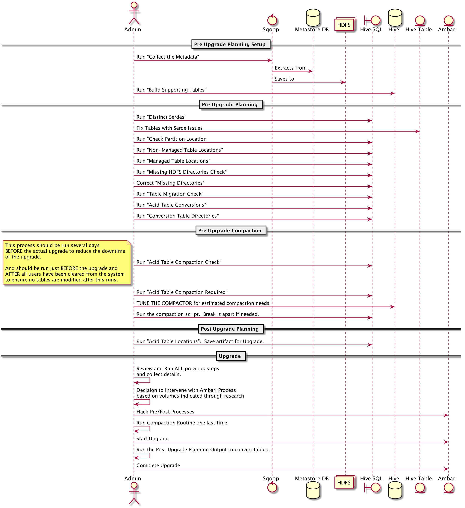

# hdp3_upgrade_utils

Upgrading from Hive 1/2 to Hive 3 requires several metastore AND data changes to be successful.

This process and the associated scripts are meant to be used as a 'pre-upgrade' planning toolkit to make the upgrade smoother.

These scripts don't make any direct changes to hive, rather they are intended to educate and inform you of areas that need attention.  After which, it is up to you to make the adjustments manually.

We'll use a combination of Hive SQL and an interactive HDFS client [Hadoop-Cli](https://github.com/dstreev/hadoop-cli) to combine information from an extract of the Metastore DB and the contents of HDFS.

## Assumptions

NOTES:

 Date | Details |
:-----|:-----|
 2019-07-11 | I found an issue in HadoopCli v2.0.13+ regarding output.  Please update to v.2.0.15+ |

1. This process needs to run as a privilege user.  In this case, it should run as the 'hive' user to ensure all access is appropriate.
2. If you are using Ranger (I hope so!!), and have given the 'hive' user access to parts of HDFS, make sure the user also has access to the 'new' warehouse directories that will be created by this process. Those include:
    a. `/warehouse/tablespace/external/hive`
    b. `/warehouse/tablespace/managed/hive`
3. This process is run from a HDP Edge node that has the HDFS Client, HDFS Configs and Hive(Beeline) Client installed.
4. The Hadoop CLI (described below) has been installed.
5. A Kerberos Ticket (for Kerberized environments) has been retrieved before running these processes.
6. The authenticated user has "at least" read privileges to ALL 'hive table' and 'hdfs'. Suggest running as the 'hive' user.
7. To issue changes to 'hdfs', the user should have super user privileges to the target directories in hdfs.  Suggest running as the 'hive' user.
8. Ranger permissions have been created for 'hive' that allow it access as described in the two previous steps.

## WARNINGS

1. Some of the processes covered hear will examine the contents of HDFS via the Namenode.  The results could spike RPC Queues on clusters that aren't optimized.  I suggest monitoring NN RPC pressure when running large amounts of data through the Hadoop Cli.
 
## Don't skip ME!!

1. Before the upgrade starts, make a snapshot of all your affect Hive Managed table locations.  The upgrade will convert and move things.  This is a last resort fallback process to get to your raw 'before' upgrade data.
    - Take this snapshot AFTER the 'MAJOR' compactions have completed.

## Summary



## Calling Hive

We use Hive throughout this process.  The process has been validated against Hive3, using Beeline against LLAP.  To use against LLAP in HDP 2.6, you'll need to build a 'beeline' wrapper to connect automatically.  The output of 'beeline' will be a little different then the output of 'hive cli'.  So I recommend using 'beeline' in HDP 2.6 for this process since the pipeline has particular dependencies.

## Environment variables for this process

### Hive

- HDP 3 - `export HIVE_ALIAS="hive -c llap"`
- HDP 2.6 - `export HIVE_ALIAS=hive`
NOTE: I attempted `beeline` in 2.6.5, but ran into variable passing issues with hivevar.

### Script vars

Set the following environment variable to assist with these scripts

I suggest using a 'new' database to avoid issues with location overrides.

The 'DUMP_ENV' var is intended to be something like: 'dev','qa','test','prod'.  This way you can run several tests and discoveries in a lower environment by extracting data from upper environments.

```
export TARGET_DB=<target_db>
export DUMP_ENV=<dump_env>
export OUTPUT_DIR=<base_output_dir>
export EXTERNAL_WAREHOUSE_DIR=<ext_wh_dir>
# Set this when using beeline
export HIVE_OUTPUT_OPTS="--showHeader=false --outputformat=tsv2"
# Set this when using hive
export HIVE_OUTPUT_OPTS=

# For Example:
export TARGET_DB=mycompany
export DUMP_ENV=dev
export EXTERNAL_WAREHOUSE_DIR=/apps/hive/warehouse
export OUTPUT_DIR=/tmp

```

## The Process

### Collect the Metadata

Run the [sqoop dump utility](./hms_sqoop_dump.sh) to extract a dataset from the Metastore Database.  Sqoop will drop the dataset on HDFS.

> NOTE: If you have defined 'lower_case_table_names' in my.cnf for MySql/MariaDB, add the --lower option to the call to select the correct extract sql for 'Sqoop'.

```
./hms_sqoop_dump.sh --target-hdfs-dir \
${EXTERNAL_WAREHOUSE_DIR}/${TARGET_DB}.db/hms_dump_${DUMP_ENV} \
--jdbc-db-url jdbc:mysql://<host:port>/<db_name> \
--jdbc-user <user> --jdbc-password <password>
```

The 'target-hdfs-dir' is where you'll define the 'external' table for this dataset.  The location should coincide with the standard external dataset location.
    
### Build Supporting Tables
Run the [Hive HMS Schema Creation Script](./hms_dump_ddl.sql) to create the external table onto of the location you placed the sqoop extract.

```
${HIVE_ALIAS} --hivevar DB=${TARGET_DB} --hivevar ENV=${DUMP_ENV} \
--hivevar EXTERNAL_WAREHOUSE_DIR=${EXTERNAL_WAREHOUSE_DIR} -f hms_dump_ddl.sql
```

Validate the dataset is visible via 'beeline'.

```
${HIVE_ALIAS} --hivevar DB=${TARGET_DB} --hivevar ENV=${DUMP_ENV}
```

In Beeline:

```
use ${DB};

select * from hms_dump_${ENV} limit 10;
```

### Start Researching the Extract
Review each of the following scripts. Each script contains a description of it's function.
    
#### Distinct Serdes

[SQL](./distinct_serdes.sql)

Old serde's in the system will prevent the post-migration scripts from completing.  Find those missing serde's and either ensure they're available to Hive OR drop the old tables.
       
```
${HIVE_ALIAS} --hivevar DB=${TARGET_DB} --hivevar ENV=${DUMP_ENV} -f distinct_serdes.sql
```
       
#### Find table with Serde x 

[SQL](./serde_tables.sql)

Once you found a suspect serde from above, use this query to located the tables that use it.
       
```
  export FIND_SERDE=<serde>
  ${HIVE_ALIAS} --hivevar DB=${TARGET_DB} --hivevar ENV=${DUMP_ENV} \
  --hivevar SERDE=${FIND_SERDE} -f serde_tables.sql
```
       
### Are you following Best Practices?

#### Check Partition Location

[SQL](./check_partition_location.sql)

Many assumptions are made about partition locations.  When these location aren't standard, it may have an effect on other migration processes and calculations.  This script will help identify that impact.
        
```
${HIVE_ALIAS} --hivevar DB=${TARGET_DB} --hivevar ENV=${DUMP_ENV} -f check_partition_location.sql
```
                
#### Non-Managed Table Locations

[SQL](./external_table_location.sql)

Determine the overall size/count of the tables locations
        
```
${HIVE_ALIAS} --hivevar DB=${TARGET_DB} --hivevar ENV=${DUMP_ENV} \
  --showHeader=false --outputformat=tsv2 -f external_table_location.sql
```
    
```
${HIVE_ALIAS} --hivevar DB=${TARGET_DB} --hivevar ENV=${DUMP_ENV} \
${HIVE_OUTPUT_OPTS} -f external_table_location.sql | \
cut -f 3 | sed -r "s/(^.*)/count \1/" | \
hadoopcli -stdin -s | sed -r "s/[ ]{2,}/\t/g" | sed -r "s/\s\//\t\//g" | \
sed -r "s/^\t//g"> ${OUTPUT_DIR}/external_table_stats.txt  
```

Copy the above file to HDFS

```
hdfs dfs -copyFromLocal ${OUTPUT_DIR}/external_table_stats.txt \
${EXTERNAL_WAREHOUSE_DIR}/${TARGET_DB}.db/dir_size_${DUMP_ENV}
```

#### Managed Table Locations

[SQL](./managed_table_location.sql)

Determine the overall size/count of the tables locations
    
```
${HIVE_ALIAS} --hivevar DB=${TARGET_DB} --hivevar ENV=${DUMP_ENV} \
         --showHeader=false --outputformat=tsv2 -f managed_table_location.sql
```
    
```
${HIVE_ALIAS} --hivevar DB=${TARGET_DB} --hivevar ENV=${DUMP_ENV} \
${HIVE_OUTPUT_OPTS} -f managed_table_location.sql | \
cut -f 3 | sed -r "s/(^.*)/count \1/" | \
hadoopcli -stdin -s | sed -r "s/[ ]{2,}/\t/g" | sed -r "s/\s\//\t\//g" | \
sed -r "s/^\t//g" > ${OUTPUT_DIR}/managed_table_stats.txt
```

Copy the above file to HDFS

```
hdfs dfs -copyFromLocal ${OUTPUT_DIR}/managed_table_stats.txt \
${EXTERNAL_WAREHOUSE_DIR}/${TARGET_DB}.db/dir_size_${DUMP_ENV}
```
#### Overlapping Table Locations

Tables sharing the same HDFS location can cause a lot of problems if one or (both/all) are managed.  The conversions could move the datasets and leave the remaining tables in a strange state.

[Overlapping Table Locations](./overlapping_table_locations.sql)

```
${HIVE_ALIAS} --hivevar DB=${TARGET_DB} --hivevar ENV=${DUMP_ENV} \
         ${HIVE_OUTPUT_OPTS} -f overlapping_table_locations.sql
```

If you find entries in this output AND one of the tables is 'Managed', you should split that locations and/or manage these overlapping locations before the migration process.

One solution would be to ensure the tables sharing the location are 'External' tables.

If all the offending tables pointed in each line of the output are 'External' already, you should be ok.      
      
        
#### Missing HDFS Directories Check

[SQL](./missing_table_dirs.sql)

The beeline output can be captured and pushed into the 'HadoopCli' for processing.  The following command will generate a script that can also be run with '-f' option in 'HadoopCli' to create the missing directories.
 
Even though we push this through hadoopcli for the hdfs test function, this will take some time to run.  If you want to see the progress, open another window session and tail the 'hcli_mkdir.txt' file.
 
```
${HIVE_ALIAS} --hivevar DB=${TARGET_DB} --hivevar ENV=${DUMP_ENV} -f missing_table_dirs.sql
```

Build a script to 'Create' the missing directories.        
```
${HIVE_ALIAS} --hivevar DB=${TARGET_DB} --hivevar ENV=${DUMP_ENV} \
${HIVE_OUTPUT_OPTS}  -f missing_table_dirs.sql | \
hadoopcli -stdin -s 2>&1 >/dev/null | cut -f 4 | \
sed 's/^/mkdir -p /g' > ${OUTPUT_DIR}/hcli_mkdir.txt
```


Review the output file 'hcli_mkdir.txt', edit if necessary and process through 'hadoopcli'.

```
hadoopcli -r hcli_mkdir.txt
```

### What might be moving in the Post-Migration Script

The post migration process runs a hive process call 'HiveStrictManagedMigration'.  This process will scan the databases and tables in the Metastore and determine what needs to be converted and moved to adhere to the new standards in Hive 3. 
            
#### Table Migration Check

[SQL](./table_migration_check.sql)

This will produce a list of tables and directories that need their ownership checked.  If they are owned by 'hive', these 'managed' tables will be migrated to the new warehouse directory for Hive3.
    
```
${HIVE_ALIAS} --hivevar DB=${TARGET_DB} --hivevar ENV=${DUMP_ENV} \
-f table_migration_check.sql
```

```        
${HIVE_ALIAS} --hivevar DB=${TARGET_DB} --hivevar ENV=${DUMP_ENV} \
${HIVE_OUTPUT_OPTS} -f table_migration_check.sql | \
cut -f 1,2,5,6 | sed -r "s/(^.*)(\/apps.*)/lsp -c \"\1\" -f user,group,permissions_long,path \2/" | \
hadoopcli -stdin -s > ${OUTPUT_DIR}/migration_check.txt
```
    
#### Acid Table Conversions

[SQL](./acid_table_conversions.sql)

This script provides a bit more detail then [Table Migration Check](./table_migration_check.sql), which only looks for tables in the standard location.

```        
${HIVE_ALIAS} --hivevar DB=${TARGET_DB} --hivevar ENV=${DUMP_ENV} -f acid_table_conversions.sql
```
    
#### Conversion Table Directories - Bad Files that will prevent ACID conversion

[SQL](./table_dirs_for_conversion.sql)

Locate Files that will prevent tables from Converting to ACID.

The 'alter' statements used to create a transactional table require a specific file pattern for existing files.  Files that don't match this, will cause issues with the upgrade.

##### Acceptable Filename Patterns

__Known__

- ([0-9]+_[0-9]+)|([0-9]+_[0-9]_copy_[0-9]+)
        
Get a list of table directories to check and run that through the 'Hadoop Cli' below to locate the odd files.

```
${HIVE_ALIAS} --hivevar DB=${TARGET_DB} --hivevar ENV=${DUMP_ENV} -f table_dirs_for_conversion.sql
```

Using the directories from the [Table Directories for Conversion](./table_dirs_for_conversion.sql) script, we'll check each directory for possible offending file that may get in the way of converting them to an ACID table.

The 'hadoopcli' function 'lsp' does an 'inverted' pattern search for all files that do NOT match the 'GOOD_PATTERN' declared below.

NOTE: The inverted search functionality for 'lsp' in 'HadoopCli' is supported in version 2.0.14-SNAPSHOT and above.
    
```
export GOOD_PATTERN="([0-9]+_[0-9]+)|([0-9]+_[0-9]_copy_[0-9]+)"
${HIVE_ALIAS} --hivevar DB=${TARGET_DB} --hivevar ENV=${DUMP_ENV} \
${HIVE_OUTPUT_OPTS} -f table_dirs_for_conversion.sql | \
sed -r "s/(^.*)/lsp -R -F ${GOOD_PATTERN} -i \
-Fe file -v file -f parent,file \1/" | hadoopcli -stdin -s >> ${OUTPUT_DIR}/bad_file_patterns.txt      
```

Figure out which pattern to use through testing with 'lsp' in [Hadoop Cli](https://github.com/dstreev/hadoop-cli)

> `lsp -R -F .*.c000 <path>` will recurse the path looking for files with a 'c000' extension.
        
### Managed / ACID Table Compactions

In Hive 3, ALL managed tables are ACID tables.  Managed tables in Hive 1/2 that are ACID/Transactional need to be compacted BEFORE converting to Hive 3.  This is because the 'delta' file formats used in ACIDv1 (Hive 1/2) is NOT compatible with Hive 3 ACIDv2.

The current Pre-Upgrade tool (as of June 2019) runs as a linear process.  So if you have a LOT of tables and partitions, the process could take a very long time.  And since the process scans the Metastore, even if you have a small number of "Managed-ACID" tables, it will take a long time to process them.

So, this process is designed to allow you to skip that step.  How?  Well, we need to collect a bunch of data from the metastore dump retrieved above and compare that with the actual filesystem to determine exactly which tables NEED to be compacted.

>NOTE: These tables need to go through a 'MAJOR' compaction and consolidate away all of the 'delta' transactions BEFORE upgrading.  'delta' datasets in a table that are NOT compacted away BEFORE the upgrade will NOT be readable AFTER the upgrade.

#### Acid Table Compaction Check

[SQL](./acid_table_compaction_check.sql)

Build a list of ACID tables/partitions that we need to scan for delta's.  If they have delta's, they MUST be COMPACT 'MAJOR' before upgrading.

```
${HIVE_ALIAS} --hivevar DB=${TARGET_DB} --hivevar ENV=${DUMP_ENV} \
${HIVE_OUTPUT_OPTS} -f acid_table_compaction_check.sql
```
    
Now process the same query and feed it through the HadoopCli to inspect HDFS. This process will scan each of the listed directories and search for _delta_ ACID contents.  The resulting output will contain all the folders that have such entries.  These are the directories of tables/partitions that need to be 'MAJOR' COMPACTed.
    
```
${HIVE_ALIAS} --hivevar DB=${TARGET_DB} --hivevar ENV=${DUMP_ENV} \
${HIVE_OUTPUT_OPTS} -f acid_table_compaction_check.sql | \
cut -f 4 | \sed -r "s/(^.*)/lsp -R -F .*delta_.* -t -sp -f path \1/" | \
hadoopcli -stdin -s > ${OUTPUT_DIR}/delta_tbls-parts_paths.txt
```
    
Copy those results to HDFS, into an HDFS directory create in the [Setup SQL Script](./hms_dump_ddl.sql) for the 'paths_${ENV}' table in the 'section=managed_deltas' partition.
    
```
hdfs dfs -copyFromLocal -f ${OUTPUT_DIR}/delta_tbls-parts_paths.txt \
${EXTERNAL_WAREHOUSE_DIR}/${TARGET_DB}.db/paths_${DUMP_ENV}/section=managed_deltas/
```
    
#### Acid Table Compaction Required

[SQL](./acid_table_compaction_reqs.sql)

Using the scan from above, we join it back to the ACID table listing and generate a COMPACT script that we can run against the cluster.
     
```
${HIVE_ALIAS} --hivevar DB=${TARGET_DB} --hivevar ENV=${DUMP_ENV} \
${HIVE_OUTPUT_OPTS} -f acid_table_compaction_reqs.sql > ${OUTPUT_DIR}/compact_major.sql 
```

This produced 'compact_major.sql' file may be large, containing 1000's of compact actions depending on how many ACID tables you have in your environment.

To handle the load of running these compactions, you will need to tune the compactor appropriately for the load.

The tuning process will depend on how many yarn resources you have to spare in the environment. The compactor can be tuned to run these jobs in a specific queue so you can isolate the workload.  Increasing the number of threads used by the compactor will control how many compaction jobs run at a time.  The size of the queue will determine the overall volume of work the process can handle.

I recommend splitting the output script above into 1000-2000 line scripts that you can launch and monitor, before continuing on to the next.

TODO: Details on Tuning the Hive Compactor.

Once completed, I would run the whole process again to check for any missed tables.  When the list is emtpy, you've covered them all.

### WIP - Pre Upgrade Tool Run via the Upgrade

During the cluster upgrade, Ambari will run a process called the "PreUpgrade" Tool as described in the [Ambari Major Upgrade - Preparing Hive for Upgrade](https://docs.hortonworks.com/HDPDocuments/Ambari-2.7.3.0/bk_ambari-upgrade-major/content/prepare_hive_for_upgrade.html).  All the work we've done to this point was designed to replace that process through a more targeted inspection.

By running the above `compact_major.sql` before the upgrade, we can avoid running this pre-upgrade process driven by Ambari.  We'll need to hack at Ambari (before you start the HDP upgrade) to turn this script off.

#### Target Script on Ambari-Server

TODO: Describe how to disable during upgrade process.

/var/lib/ambari-server/resources/common-services/HIVE/0.12.0.2.0/package/scripts/pre-upgrade.py 
    
### Post Upgrade / BEFORE Using Hive 3

#### Acid Table Locations

[SQL](./acid_table_location_status.sql)

Only **managed** tables in standard locations will be "moved" by the post-migration process.  Use this to understand that impact.

This script will identify all **managed** tables and indication if they **may** move, based on being in a **"Standard"** location.

It will also indicate whether the table is **currently** transactional or **not**.

```
${HIVE_ALIAS} --hivevar DB=${TARGET_DB} --hivevar ENV=${DUMP_ENV} \
-f acid_table_location_status.sql
```

For LARGE Hive Installations, build an alter Migration Script

The Migration Script MUST run against EVERY DB that contains tables the are 'managed'. These migration scripts MUST be completed BEFORE users are allowed back on the cluster.  This process is intended to allow the 'parallel' running of the core 'HiveStrictManagedMigration' process when upgrade to Hive 3. Default processing through Ambari of this script is NOT threaded and therefore can take a very long time in environments with a lot of metadata.

```
${HIVE_ALIAS} --hivevar DB=${TARGET_DB} --hivevar ENV=${DUMP_ENV} \
${HIVE_OUTPUT_OPTS} -f post_migration_dbs.sql \
> ${OUTPUT_DIR}/post_migration.txt
```

Build a script to call the post migration script 'HiveStrictManagedMigration' process for each of the databases independently listed in the above output.


Note: There is a 'dryrun' option for this script.  I suggest running that on a single, smaller DB to evaluate that everything is configured correctly before launching against the entire stack.

Review and run [Post Migration Hive Strict Managed Migration Launcher](./post_migration.sh) to run a migration process for each database, independently.  

TODO: Figure out how to log calls to tables, which is DEBUG.  Use this to estimate table processing times.

>Watch the volume!!!  If you have many database, I recommend carving this process up to run a maximum of 10 databases at a time!! 

#### Modify Upgrade Process to Skip/Shortcut migration script.

WARNING: By doing this, you are taking on the **responsibility** of running this process against ALL appropriate databases and tables.

On the Ambari Server, find: `/var/lib/ambari-server/resources/stacks/HDP/3.0/services/HIVE/package/scripts/post_upgrade.py`
- Make a safe copy of the `/var/lib/ambari-server/resources/stacks/HDP/3.0` directory.
- Edit: `/var/lib/ambari-server/resources/stacks/HDP/3.0/services/HIVE/package/scripts/post_upgrade.py`
- Comment out line: `  HivePostUpgrade().execute()`
- Add Line below that: `  print ('Manual Override, run strictmanagedmigration process separately.)`
- Save file.

##### Reference Call
```{hive_script} --config /etc/hive/conf --service  strictmanagedmigration --hiveconf hive.strict.managed.tables=true  -m automatic  --modifyManagedTables --oldWarehouseRoot /apps/hive/warehouse"
```

##### Reference For HiveStrict Command

```
hive --service strictmanagedmigration --help

usage: org.apache.hadoop.hive.ql.util.HiveStrictManagedMigration
 -d,--dbRegex <arg>                         Regular expression to match
                                            database names on which this
                                            tool will be run
    --dryRun                                Show what migration actions
                                            would be taken without
                                            actually running commands
 -h,--help                                  print help message
    --hiveconf <property=value>             Use value for given property
 -m,--migrationOption <arg>                 Table migration option
                                            (automatic|external|managed|va
                                            lidate|none)
    --modifyManagedTables                   This setting enables the
                                            shouldModifyManagedTableLocati
                                            on,
                                            shouldModifyManagedTableOwner,
                                            shouldModifyManagedTablePermis
                                            sions options
    --oldWarehouseRoot <arg>                Location of the previous
                                            warehouse root
    --shouldModifyManagedTableLocation      Whether managed tables should
                                            have their data moved from the
                                            old warehouse path to the
                                            current warehouse path
    --shouldModifyManagedTableOwner         Whether managed tables should
                                            have their directory owners
                                            changed to the hive user
    --shouldModifyManagedTablePermissions   Whether managed tables should
                                            have their directory
                                            permissions changed to conform
                                            to strict managed tables mode
 -t,--tableRegex <arg>                      Regular expression to match
                                            table names on which this tool
                                            will be run

```

By shortcutting Ambari's version of this process, we need to build a list of **Db's** and Tables that need to run through the post migration process.  When know, we run the process manually, targeting only those areas that are important (hive tables that "NEED" to be reviewed), instead of processing the whole system, one at a time.  

With the data collected from 'External/Managed Table Locations', we can run the following and get table and db sizes.

TODO: Build script with DB contents and run.


NOTE: This section depends on the output from [Non-Managed Table Locations](#non-managed-table-locations) and [Managed Table Locations](#managed-table-locations) 
```
${HIVE_ALIAS} --hivevar DB=${TARGET_DB} --hivevar ENV=${DUMP_ENV} \
${HIVE_OUTPUT_OPTS} -f size_of_dbs.sql > ${OUTPUT_DIR}/dbs_sizes.txt
```

The output will be a list of databases with the following:
- db_name
- tbl_count
- folder_count
- file_count
- total_size
        
## Hadoop CLI

An interactive/scripted 'hdfs' client that can be scripted to reduce the time it takes to cycle through 'hdfs' commands.  

[Hadoop CLI Project/Sources Github](https://github.com/dstreev/hadoop-cli)

Note: As of this writing, version [2.0.15-SNAPSHOT](https://github.com/dstreev/hadoop-cli/releases/tag/2.0.15-SNAPSHOT) (or later) is required for this effort.

Fetch the latest Binary Distro [here](https://github.com/dstreev/hadoop-cli/releases) . Unpack the hadoop.cli-x.x.x-SNAPSHOT-x.x.tar.gz and run (as root) the setup from the extracted folder. Detailed directions [here](https://github.com/dstreev/hadoop-cli).

`./setup.sh`

Launch the application without parameters will pickup your default configs, just like `hdfs` or `hadoop` command line applications.

`hadoopcli`

### Usage Scenario

#### STDIN Processing

The Hadoop Cli can process `stdin`.  So it can be part of a bash pipeline.  In this case, we run a query in beeline, output the results and create another file with our target commands.

```
hive -c llap --hivevar DB=citizens --hivevar ENV=qa \
--showHeader=false --outputformat=tsv2  -f test.sql | \
hadoopcli -stdin 2>&1 >/dev/null | cut -f 4 | \
sed 's/^/mkdir -p /g' > hcli_mkdir.txt
```

#### File Based Script

Test a list of directories against 'hdfs' to see if they exist.  See above 'Missing HDFS Directories Check'.

Create a text file (test.txt) and add some commands.  The last line should 'exit' followed by an empty line.
```
test -e /user/ted
test -e /user/chuck
test -e /apps/hive/warehouse/my_db.db/some_random_tbl
exit

```
Then run the 'hadoopcli' with the text file as an init script.

`hadoopcli -f test.txt 2> missing.out`

This will pipe all 'errors' to 'missing.out'.  The 'test' command throws an error when the directory doesn't exist.
